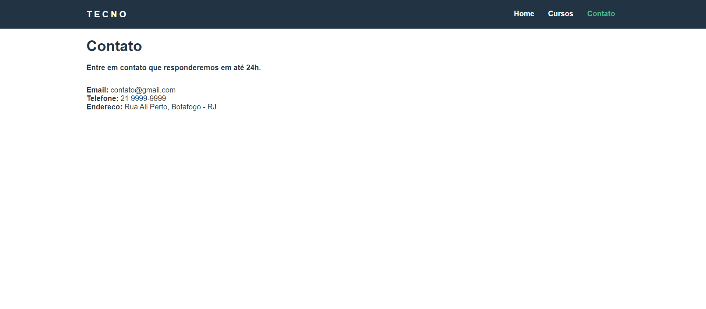
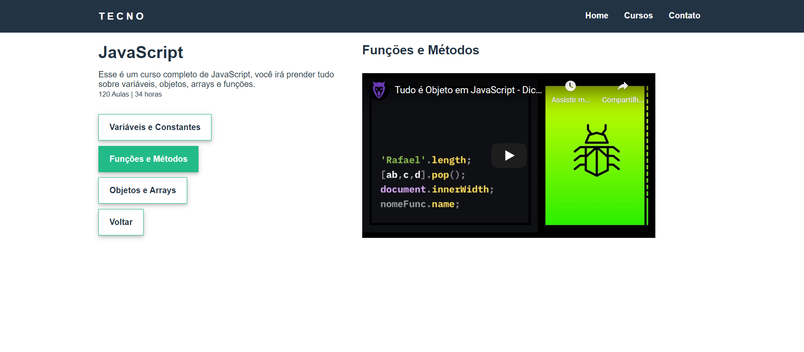
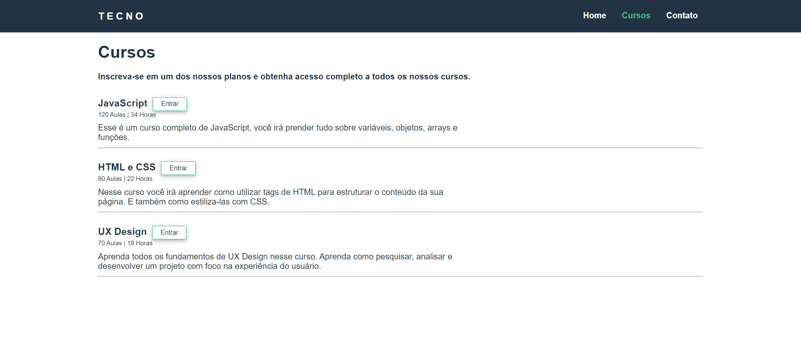
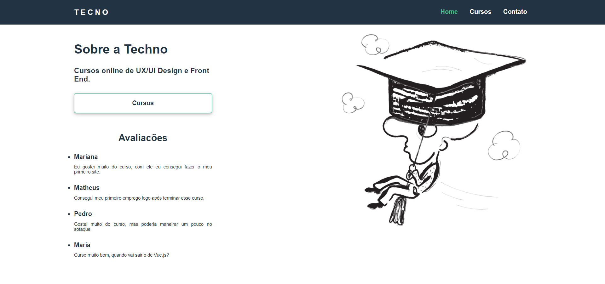

<h1 align="center">Tecno-cursos</h1>
<i>Status: completo</i>

## Descrição

Projeto desenvolvido para fins educacionais, afim de consolidar todo o conteudo absorvido durante os estudos com mini-cursos, blogs, publicações, documentações e livros.

## Sobre

Front-end simples para um projeto de gerenciamento de cursos, onde esta consumindo uma api false executado pelo json-server.

### Instalação

```
npm install
```

### Compilação

###### Developer

```
npm run serve
```

###### Production

```
npm run build
```

###### api

```
json-server api.json
```

### Recursos

- [x] Lista de cursos
- [x] Video-aulas dos cursos
- [x] Comentarios da plataforma
- [x] Contato

### Tecnologias

- Vue.js
- Javascript
- HTML
- Css

### Projeto

<table>
<tr>
<td></td>
<td></td>
<td></td>   
<tr>
<td></td>
<td></td>   
<tr>
</table>

### Contribuição

- Felicio F. M. Neto
